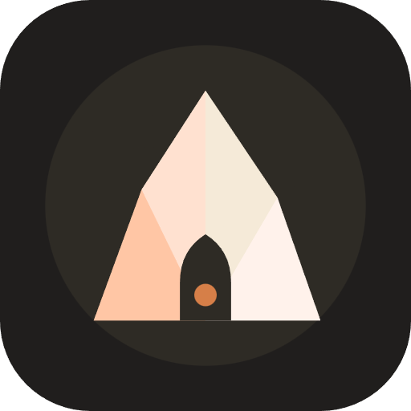

<p align="center">
  
</p>

<h1 align="center">Utumno</h1>

<p align="center">
  A clean, minimal desktop shell for Linux — top bar, app launcher, wallpaper picker,
  lock screen, session menu, volume/brightness display and a local AI chat popup.
</p>

---

## What is this?

Utumno adds a lightweight desktop bar and a handful of everyday tools on top of a
Wayland desktop: a launcher to start apps, a picker to change your wallpaper, a lock
screen, a menu to suspend/reboot/log out, on-screen volume and brightness feedback, and
a popup to chat with a locally-running AI model.

It's built on **[Quickshell](https://quickshell.org)** (the `qs` command) and works on
**[niri](https://github.com/YaLTeR/niri)** and **[Hyprland](https://hyprland.org)** (Sway
and other similar compositors should work too, but are less tested).

> **Already using [quickshell-d77](https://github.com/dani-77/quickshell-d77)?** Utumno
> is its smaller sibling — same look, same keybinds, same shortcuts — just without the
> dashboard, music player and login screen. The two share settings (like the AI chat's
> last-used model), so switching between them, or running them on different machines,
> feels the same. If you want the fuller experience, get quickshell-d77 instead; if you
> want something leaner, Utumno is for you.

## Before you install

You need **Quickshell** (the `qs` command) installed and working, plus one of the
supported compositors (niri or Hyprland). See the
[Quickshell installation guide](https://quickshell.org/docs/master/start/installation/)
for your distribution.

## Installing

Clone Utumno straight into Quickshell's config folder:

```sh
git clone https://github.com/dani-77/utumno ~/.config/quickshell/utumno
```

Then tell your compositor to start it automatically when you log in.

**On niri**, add this line to your `config.kdl`:

```kdl
spawn-at-startup "qs" "-c" "utumno"
```

**On Hyprland**, add this line to your `hyprland.conf`:

```
exec-once = qs -c utumno
```

Log out and back in (or restart the compositor) and the bar should appear at the top of
your screen.

## Using it

Once it's running, everything is driven from the bar or a few keyboard shortcuts.

On the bar (left to right): a **launcher** button to open apps, an **AI** button to open
the chat popup, then the clock, weather, CPU/RAM, volume, network and battery — and a
**power** button on the right to suspend, reboot, log out or shut down.

Suggested shortcuts to add to your compositor config:

| Shortcut | Action |
|---|---|
| `Mod + D` | Open/close the app launcher |
| `Mod + Y` | Open/close the wallpaper picker |
| `Mod + L` | Lock the screen |
| `Mod + Shift + E` | Open/close the power menu |
| Volume/brightness keys | Show the on-screen volume/brightness indicator |

**niri** (`config.kdl`):

```kdl
binds {
    Mod+D          { spawn "qs" "-c" "utumno" "ipc" "call" "launcher" "toggle"; }
    Mod+Y          { spawn "qs" "-c" "utumno" "ipc" "call" "wallpaper" "toggle"; }
    Mod+L          { spawn "qs" "-c" "utumno" "ipc" "call" "lockscreen" "lock"; }
    Mod+Shift+E    { spawn "qs" "-c" "utumno" "ipc" "call" "session" "toggle"; }
}
```

**Hyprland** (`hyprland.conf`):

```
bind = SUPER, D, exec, qs -c utumno ipc call launcher toggle
bind = SUPER, Y, exec, qs -c utumno ipc call wallpaper toggle
bind = SUPER, L, exec, qs -c utumno ipc call lockscreen lock
bind = SUPER SHIFT, E, exec, qs -c utumno ipc call session toggle
```

> **Tip:** all of those `qs -c utumno ipc call ...` commands can be shortened if you have
> [`qsd77`](https://github.com/dani-77/qsd77) installed — a small companion CLI for
> quickshell-d77 and Utumno. Since it targets quickshell-d77 by default, point it at
> Utumno with `-c utumno`:
>
> ```sh
> qsd77 launcher -c utumno
> qsd77 wallpaper -c utumno
> qsd77 locker -c utumno
> qsd77 session -c utumno
> ```

### The AI chat popup

Click the green **AI** button on the bar to open a chat window that talks to a
[Ollama](https://ollama.com) instance running on your own machine — nothing is sent
anywhere else. If Ollama has no models installed yet, Utumno downloads a small one
automatically so there's something to chat with right away; you can switch to a bigger
model any time from the popup itself.

### Changing your wallpaper

Press `Mod + Y` (or click the wallpaper picker) to browse and pick a wallpaper from a
grid. Your choice is remembered and re-applied automatically the next time you log in.

## Uninstalling

```sh
rm -rf ~/.config/quickshell/utumno
```

...and remove the `spawn-at-startup`/`exec-once` line you added to your compositor
config.

## More

For architecture notes, the full list of modules, and the complete IPC reference, see the
[technical documentation](doc/README.md).

## License

MIT — see [LICENSE](LICENSE).
